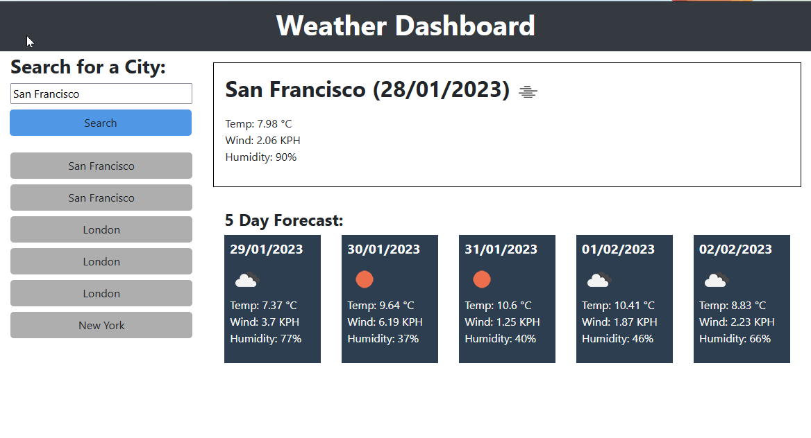

# Challenge - Work Day Scheduler

## Description

A weather dashboard application powered by **openweathermap.org** web API(s) that will allow you to search for the weather report & 5 day forecast of your chosen city.

It will display the current weather showing the temperature, wind speed & humidity.

Below the main weather report there is a 5 day forecast.

## Live demo

[View deployed application on Github Pages](https://gurdeep-ninja.github.io//Weather-Dashboard/)

## Screenshots

## Installation & usage

### Installation

Clone or download this project as a zip file & extract to your websites root directory.

Simply open the `index.html` file in your browser to use the scheduler.

### Usage

Simply enter the city you would like to see the weather for and click search. If there are no results, the application will prompt you on the error.

The search history will even when you refresh the page.

## Technologies
    